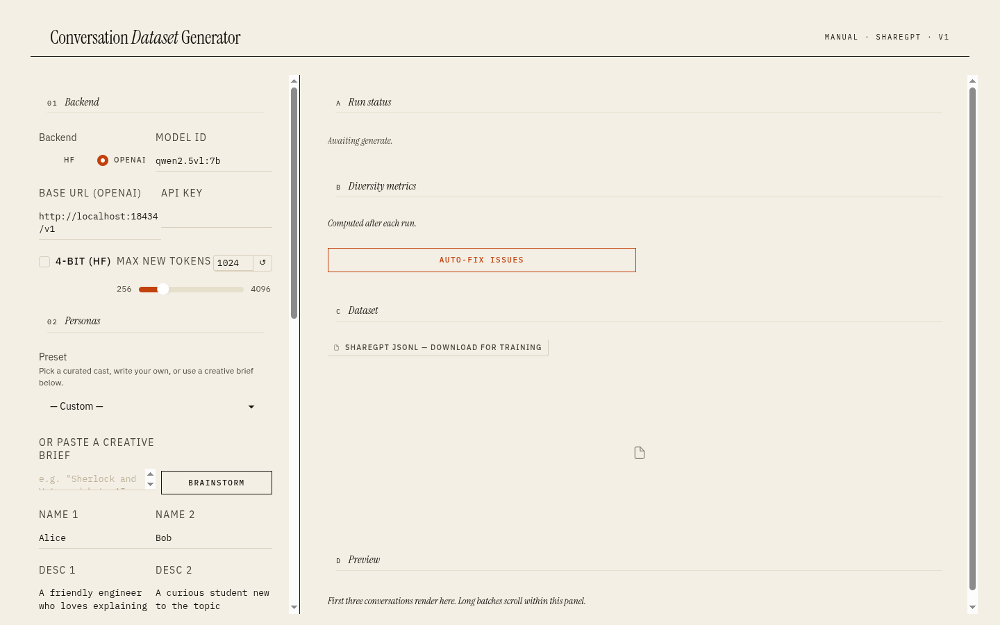
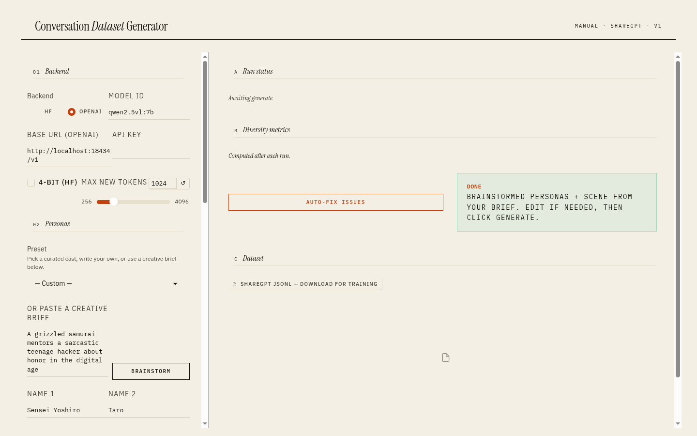
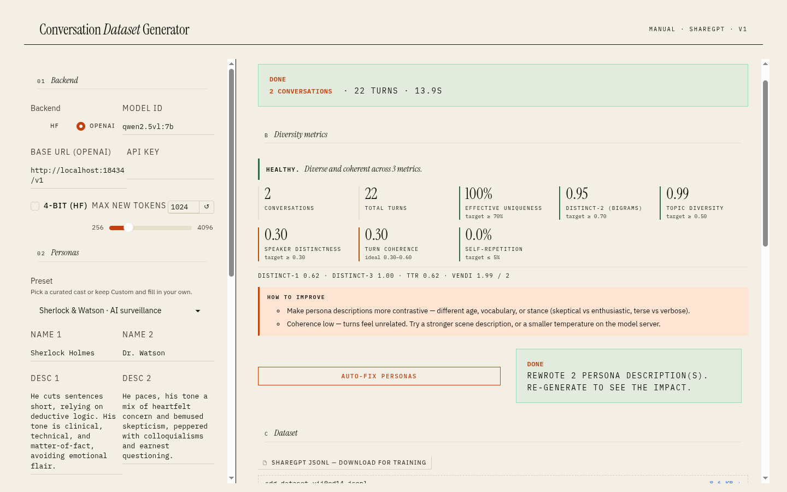

# Conversation Dataset Generator

Generate synthetic conversational datasets in ShareGPT format for LLM fine-tuning. Define personas, topics, and styles — or provide a creative brief and let the LLM figure it out.

[](LICENSE)

## Quick Start (pip)

```bash
python -m venv venv && source venv/bin/activate
pip install -r requirements.txt
python generate.py \
  --creative-brief "Sherlock Holmes and Watson debate whether AI will replace detectives" \
  --num-examples 5 --output-file conversations.jsonl
```

Requires Python 3.10+. For the default `--backend hf`, you'll also need an NVIDIA GPU with CUDA. With `--backend openai` you can use any OpenAI-compatible server (LM Studio, Ollama, OpenAI itself, etc.) — see ["Using a remote OpenAI-compatible server"](#using-a-remote-openai-compatible-server-no-local-gpu-needed) below.

## Quick Start (Docker)

The default `docker compose up` launches the Gradio dashboard at [http://localhost:7860](http://localhost:7860):

```bash
docker compose up
```

Point at any OpenAI-compatible server (LM Studio, Ollama, OpenAI itself) by setting env vars before launch:

```bash
CDG_BACKEND=openai \
CDG_BASE_URL=http://host.docker.internal:11434/v1 \
CDG_MODEL_ID=llama3.2:1b \
docker compose up
```

If you'd rather run the CLI inside the container (one-off batch jobs, etc.):

```bash
docker compose run cdg python3 generate.py \
  --creative-brief "Two scientists argue about time travel" \
  --output-file output/data.jsonl
```

Build manually if you don't want compose:

```bash
# Default CUDA 12.x — works on 30xx/40xx/50xx
docker build -t cdg .

# CUDA 13.x for RTX 50xx with latest drivers
docker build --build-arg CUDA_VERSION=13.0.0 -t cdg .

# Run the webapp (default)
docker run --gpus all -p 7860:7860 -e CDG_HOST=0.0.0.0 \
  -v $(pwd)/output:/app/output cdg

# Or run the CLI (override the default command)
docker run --gpus all -v $(pwd)/output:/app/output cdg \
  python3 generate.py --creative-brief "..." --output-file output/data.jsonl
```

## Modes

### Manual

Specify everything directly. No variation — every conversation uses the same parameters.

```bash
python generate.py \
  --topic "best pizza toppings" \
  --persona1 "Tony" --persona1-desc "A passionate Italian chef" \
  --persona2 "Dave" --persona2-desc "A pineapple-on-pizza enthusiast" \
  --scenario "kitchen argument" --style "heated but friendly debate" \
  --num-examples 10 --output-file pizza_debate.jsonl
```

### Creative Brief

Provide a high-level brief. The LLM generates personas, topic, scenario, and style, then varies the topic/scenario for each conversation.

```bash
python generate.py \
  --creative-brief "A grumpy cat and an overly enthusiastic golden retriever share a sunbeam" \
  --num-examples 20 --output-file cat_dog.jsonl
```

Optionally enrich personas with web search context:

```bash
python generate.py \
  --creative-brief "Linus Torvalds and Tim Cook debate open source" \
  --persona1-search-term "Linus Torvalds" \
  --persona2-search-term "Tim Cook Apple CEO" \
  --num-examples 10 --output-file tech_debate.jsonl
```

### Fixed Persona + Variation

Fix the personas but let the LLM vary the topic and scenario each time.

```bash
python generate.py \
  --enable-variation \
  --fixed-persona1 "Iron Man" --fixed-persona1-desc "Genius billionaire with rapid-fire wit" \
  --fixed-persona2 "Captain America" --fixed-persona2-desc "Principled, earnest, old-fashioned" \
  --initial-topic "team leadership" --initial-scenario "Avengers HQ" --initial-style "friendly disagreement" \
  --num-examples 50 --output-file avengers.jsonl
```

### Random Pairings

Randomly pair characters from YAML pool files for each conversation.

```bash
python generate.py \
  --random-pairings \
  --character-pool avengers_characters.yaml \
  --persona-desc-pool avengers_descriptions.yaml \
  --initial-topic "planning a party" --initial-scenario "break room" --initial-style "casual banter" \
  --num-examples 100 --output-file avengers_random.jsonl
```

Add `--enable-variation` to also vary topics per conversation. Use `--group-size 3` for 3-way conversations.

### Multi-Speaker (3+ Personas)

Use `--persona` (repeatable) for inline definitions or `--personas` for a YAML file:

```bash
# Inline
python generate.py \
  --persona "Iron Man" "Genius billionaire with rapid-fire wit" \
  --persona "Captain America" "Principled, earnest, old-fashioned" \
  --persona "Thor" "Boisterous god with Shakespearean formality" \
  --topic "who pays for the pizza" --scenario "Avengers break room" --style "comedic argument" \
  --num-examples 10 --output-file avengers_pizza.jsonl

# From YAML file
python generate.py \
  --personas my_characters.yaml \
  --topic "planning a heist" --scenario "warehouse" --style "tense thriller" \
  --num-examples 5 --output-file heist.jsonl
```

Personas YAML format:
```yaml
personas:
  - name: "Iron Man"
    description: "Genius billionaire with rapid-fire wit"
  - name: "Captain America"
    description: "Principled, earnest, old-fashioned"
```

### Continuing Conversations

Extend an existing conversation with more turns:

```bash
# Continue the last conversation in a file
python generate.py --continue-from conversations.jsonl --output-file more.jsonl

# Continue a specific conversation
python generate.py --continue-from conversations.jsonl --conversation-id 5 --output-file more.jsonl
```

### Batch Generation

Run multiple generation jobs from a YAML config:

```bash
python batch_generate.py examples/batch_mixed_modes.yaml
```

See `examples/` for sample batch configs.

## Argument Reference

### Mode Selection

| Flag | Description |
|---|---|
| `--creative-brief TEXT` | Creative brief for automatic parameter generation |
| `--enable-variation` | Vary topic/scenario between conversations |
| `--random-pairings` | Random character pairs from pool files |

### Manual Mode

| Flag | Description |
|---|---|
| `--topic TEXT` | Conversation topic |
| `--persona1 TEXT` | First speaker name |
| `--persona1-desc TEXT` | First speaker description |
| `--persona2 TEXT` | Second speaker name |
| `--persona2-desc TEXT` | Second speaker description |
| `--scenario TEXT` | Setting/context |
| `--style TEXT` | Dialogue style/tone |
| `--include-points TEXT` | Comma-separated keywords to include |

### Fixed Persona Variation

| Flag | Description |
|---|---|
| `--fixed-persona1 TEXT` | Fixed first speaker name |
| `--fixed-persona1-desc TEXT` | Fixed first speaker description |
| `--fixed-persona2 TEXT` | Fixed second speaker name |
| `--fixed-persona2-desc TEXT` | Fixed second speaker description |
| `--initial-topic TEXT` | Seed topic for variation |
| `--initial-scenario TEXT` | Seed scenario for variation |
| `--initial-style TEXT` | Seed style for variation |

### Random Pairings

| Flag | Description |
|---|---|
| `--character-pool FILE` | YAML file with character names |
| `--persona-desc-pool FILE` | YAML file with character descriptions |

### Multi-Speaker

| Flag | Description |
|---|---|
| `--persona NAME DESC` | Add a persona (repeatable) |
| `--personas FILE` | YAML file with personas list |
| `--train-speaker NAME` | Assign this speaker the "gpt" role |
| `--group-size N` | Characters per conversation in random pairings (default: 2) |

### Continue Conversation

| Flag | Description |
|---|---|
| `--continue-from FILE` | Continue from an existing JSONL file |
| `--conversation-id N` | Specific conversation to continue (default: last) |

### Web Search (Creative Brief)

| Flag | Description |
|---|---|
| `--persona1-search-term TEXT` | Web search term for persona 1 context |
| `--persona2-search-term TEXT` | Web search term for persona 2 context |

### General

| Flag | Default | Description |
|---|---|---|
| `--num-examples N` | 3 | Number of conversations to generate |
| `--output-file PATH` | `generated_data.jsonl` | Output file path |
| `--model-id ID` | `Qwen/Qwen2.5-7B-Instruct` | HuggingFace model for generation |
| `--max-new-tokens N` | 4096 | Max tokens per generation |
| `--load-in-4bit` | off | Enable 4-bit quantization (requires bitsandbytes) |
| `--backend {hf,openai}` | `hf` | Inference backend: local transformers (`hf`) or OpenAI-compatible HTTP server (`openai`) |
| `--api-base-url URL` | `http://localhost:1234/v1` | Server URL when `--backend openai`. Ollama: `http://localhost:11434/v1` |
| `--api-key KEY` | env `OPENAI_API_KEY` | API key for `--backend openai`. Falls back to env, then to `"not-needed"` |
| `--upload-to-hub REPO` | — | Upload dataset to HuggingFace Hub |
| `--force-upload` | off | Skip upload confirmation |
| `--role-mapping MAP` | first=human, rest=gpt | Map speaker names to roles (e.g., `"Alice=human,Bob=gpt"`) |
| `--dedup-threshold FLOAT` | off | Drop generated conversations with cosine similarity > this value to any prior. Typical range: 0.85–0.97. Requires `sentence-transformers`. |

## Output Format

Each line in the JSONL output is one conversation turn:

```json
{
  "conversation_id": 0,
  "turn_number": 0,
  "role": "human",
  "speaker_name": "Tony",
  "topic": "best pizza toppings",
  "scenario": "kitchen argument",
  "style": "heated but friendly debate",
  "include_points": "",
  "content": "So, you're telling me pineapple on pizza is the ultimate topping?"
}
```

## Role Mapping for Training

The `role` field in the output determines how training frameworks interpret each turn:
- `"human"` = input/context (the model sees this)
- `"gpt"` = target (the model learns to generate this)

**Default:** First persona is `"human"`, all others are `"gpt"`.

**Train a specific character:** Use `--train-speaker` to make one character the `"gpt"` role:

```bash
# Train the model to BE Captain America
python generate.py \
  --persona "Iron Man" "Genius billionaire" \
  --persona "Captain America" "Principled leader" \
  --persona "Thor" "Boisterous god" \
  --train-speaker "Captain America" \
  --topic "mission planning" --scenario "war room" --style "serious" \
  --output-file cap_training.jsonl
```

In the output, Captain America's turns will have `"role": "gpt"` and everyone else will have `"role": "human"`. The `speaker_name` field always stores the actual character name regardless.

**Fine-grained control:** Use `--role-mapping` for custom assignments:

```bash
--role-mapping "Iron Man=human,Captain America=gpt,Thor=human"
```

## Evaluation

Measure the quality of generated datasets with intrinsic metrics:

```bash
python evaluate.py conversations.jsonl
```

```
=== CDG Evaluation Report ===

Dataset: conversations.jsonl
Conversations: 100 | Turns: 1,247 | Avg turns: 12.5

Speakers (3):
  Iron Man                  34.2% of turns
  Captain America           33.1% of turns
  Thor                      32.7% of turns

Diversity:
  Distinct-1: 0.42 | Distinct-2: 0.81 | Distinct-3: 0.91
  Topic diversity: 0.72 (0=identical, 1=unrelated)
  Vocabulary richness (TTR): 0.68
  Vendi Score: 87.4 / 100 (effective distinct conversations; closer to N = more diverse)

Coherence:
  Turn-to-turn similarity: 0.47 (target: 0.3-0.6)
  Self-repetition rate: 2.1%

Speaker Distinctiveness:
  Avg pairwise distance: 0.38 (higher = more distinct voices)
```

**Metrics:**
- **Distinct-N** — fraction of unique n-grams. Higher = more lexically diverse.
- **Topic diversity** — embedding distance between conversation topics. 0 = all identical, 1 = completely varied.
- **Turn coherence** — how well consecutive turns relate. Sweet spot: 0.3-0.6.
- **Self-repetition** — fraction of near-duplicate turns within conversations.
- **Speaker distinctiveness** — how different each speaker's language is from others.
- **Vendi Score** — effective number of distinct conversations, computed from the eigenvalue entropy of the conversation-embedding similarity matrix. Range is `[1, N]` where `N` is the number of conversations: `1` means everything collapses to one effective example, `N` means every conversation is mutually distinct. Less sensitive than Distinct-N to surface-level paraphrases.

Options:
```bash
python evaluate.py data.jsonl --format json     # machine-readable
python evaluate.py data.jsonl --no-embeddings   # skip embedding metrics (faster)
```

## Using a remote OpenAI-compatible server (no local GPU needed)

You can drive `generate.py` against any OpenAI-compatible inference server — LM Studio, Ollama, vLLM, TGI, or the real OpenAI API. This sidesteps local CUDA and lets you use models bigger than your VRAM.

### LM Studio

Start the server in LM Studio (Server tab, default port 1234), load a model, then:

```bash
python generate.py \
  --backend openai \
  --api-base-url http://localhost:1234/v1 \
  --model-id "lmstudio-community/Qwen2.5-7B-Instruct-GGUF" \
  --creative-brief "Sherlock and Watson debate AI" \
  --num-examples 5 \
  --output-file out.jsonl
```

### Ollama

```bash
ollama pull llama3.2:1b   # or any model you like
python generate.py \
  --backend openai \
  --api-base-url http://localhost:11434/v1 \
  --model-id llama3.2:1b \
  --creative-brief "Two chefs argue about umami" \
  --num-examples 5 \
  --output-file out.jsonl
```

### OpenAI (or OpenRouter, Together, etc.)

```bash
export OPENAI_API_KEY=sk-...
python generate.py \
  --backend openai \
  --api-base-url https://api.openai.com/v1 \
  --model-id gpt-4o-mini \
  --creative-brief "..." --num-examples 5 \
  --output-file out.jsonl
```

When `--backend openai` is set, `--load-in-4bit` is silently ignored (quantization happens server-side). The default `--backend hf` preserves the original local-transformers behavior.

## Web interface

A full Gradio dashboard is available for interactive generation, evaluation, and dataset packaging.

```bash
python webapp.py
```

Opens at `http://127.0.0.1:7860`. Set defaults via env vars: `CDG_BACKEND`, `CDG_BASE_URL`, `CDG_MODEL_ID`.



### What the dashboard does

| Panel | Purpose |
|---|---|
| **Backend** | Choose `hf` (local transformers) or `openai` (any OpenAI-compatible server). Set base URL, API key, model id, max-new-tokens, 4-bit quantization. |
| **Personas** | Pick a curated preset, paste a creative brief and let the model brainstorm a cast, or write your own. Two name+description fields plus an "Add more" textarea for N-speaker conversations. A **Train speaker** dropdown picks which speaker maps to the `gpt` role for fine-tuning. |
| **Scene** | Topic, scenario, style. Optional must-cover points. |
| **Batch** | Number of conversations (1–50), per-example variation toggle, near-duplicate dedup threshold. |
| **Run status / Diversity metrics** | After Generate, the right pane shows healthy/needs-attention headline, stat grid of metrics with their **targets** (effective uniqueness, distinct-2, topic diversity, speaker distinctness, turn coherence, self-repetition), and plain-English recommendations when something misses. |
| **Auto-fix issues** | One-click dispatcher that applies every applicable fix: rewrites personas for orthogonal voice, broadens topic, sharpens scene, toggles variation, drops max-tokens — based on which metrics failed. |
| **Dataset** | Downloadable ShareGPT JSONL, ready for fine-tuning. |
| **Preview** | First three generated conversations rendered inline; full batch in the JSONL. |

### Creative brief workflow



Paste a one-line idea like `"A grizzled samurai mentors a sarcastic teenage hacker about honor in the digital age"`, click **Brainstorm**, and the model fills in personas, topic, scenario, and style. Edit if needed, then click Generate.

### Metrics with targets, not just numbers



Each stat shows actual value vs. target with traffic-light coloring. Plain-English headline names the failing dimension when something's off ("NEEDS ATTENTION: distinct voices"). Recommendations explain how to fix — and the Auto-fix button applies them.

### N-speaker conversations

The Sci-fi crew preset packs four characters (captain, archaeologist, ship AI, engineer) into one conversation. Use the "Add more" textarea (`Name | Description` per line) to add as many speakers as you want.

### What's CLI-only

These features aren't in the webapp; use `generate.py` instead:

- **`--continue-from data.jsonl`** — extend an existing conversation
- **`--random-pairings`** with `--character-pool` / `--persona-desc-pool` YAML pools
- **`--upload-to-hub REPO_ID`** — push the dataset to HuggingFace Hub
- **`--persona1-search-term` / `--persona2-search-term`** — DuckDuckGo persona context for creative brief mode
- **`--role-mapping "Name1=human,Name2=gpt"`** — manual role mapping (the webapp uses the simpler `Train speaker` dropdown)
- **`batch_generate.py examples/batch_*.yaml`** — batch jobs with mixed modes

## For Contributors

### Package Structure

| Module | Responsibility |
|---|---|
| `cli.py` | Argument parsing, mode detection, orchestration |
| `models.py` | Model/tokenizer loading, pipeline creation |
| `prompts.py` | System prompts and message builders |
| `generation.py` | LLM call wrappers with retry logic |
| `parsing.py` | Regex parsers for LLM output |
| `output.py` | JSONL writing and dataset card templates |
| `hub.py` | HuggingFace Hub upload |
| `character_pool.py` | YAML pool loading and random pairing |
| `web_search.py` | DuckDuckGo persona context search |

### Running Tests

```bash
pip install -r requirements-dev.txt
pytest tests/ -v                    # all 121 tests
pytest tests/test_parsing.py -v     # one module
```

No GPU required for tests — LLM calls are mocked.

## License

MIT. See [LICENSE](LICENSE).
